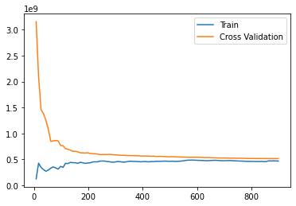
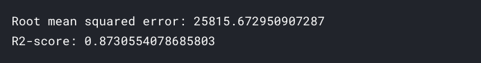
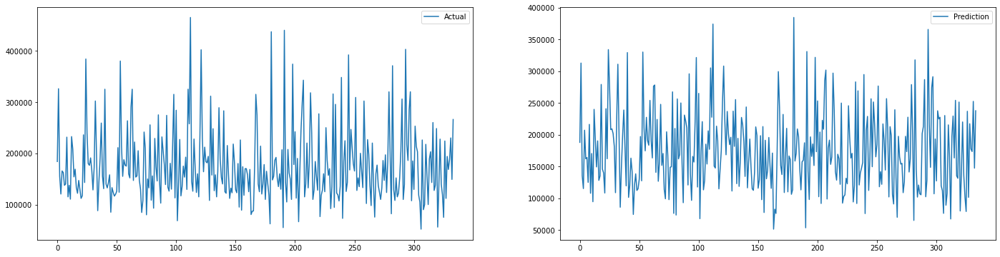
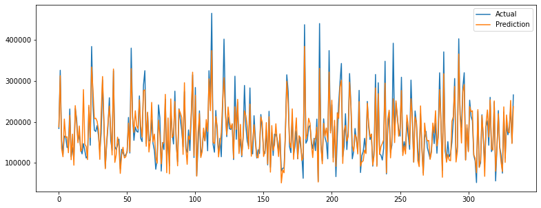

# Predict House Prices in depth EDA

In this project [House Prices - Advanced Regression Techniques](https://www.kaggle.com/c/house-prices-advanced-regression-techniques) `Kaggle's competition` dataset is used.

**While doing this we'll go through:**

- Removing outliers using `IQR` and `z-score` methods
- Visualizing `categorical` and `continuous` variables
- How to process `string` dtype columns for building `machine learning model`
- Dealing with `missing` values

## Table of contents

- [Getting started](#getting-started)
- [Findings](#findings)
- [Machine learning model](#machine-learning-model)
- [License](#license)

## Getting started

The [notebook](https://www.kaggle.com/akashsdas/predict-house-prices-in-depth-eda) is available on Kaggle to work in the same environment where this notebook was created i.e. use the same version packages used, etc...

## Findings

To know about findings in the `EDA` stage go to the [notebook](./notebook.ipynb)

## Machine learning model

**Learning curve**

**RMS and R2 scores**

**Visualizing our predictions against actual values**

## License

[APACHE LICENSE, VERSION 2.0](./LICENSE)
